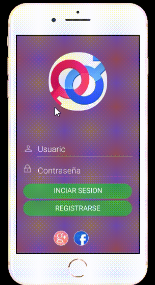
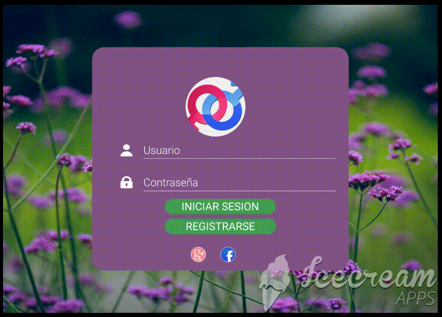
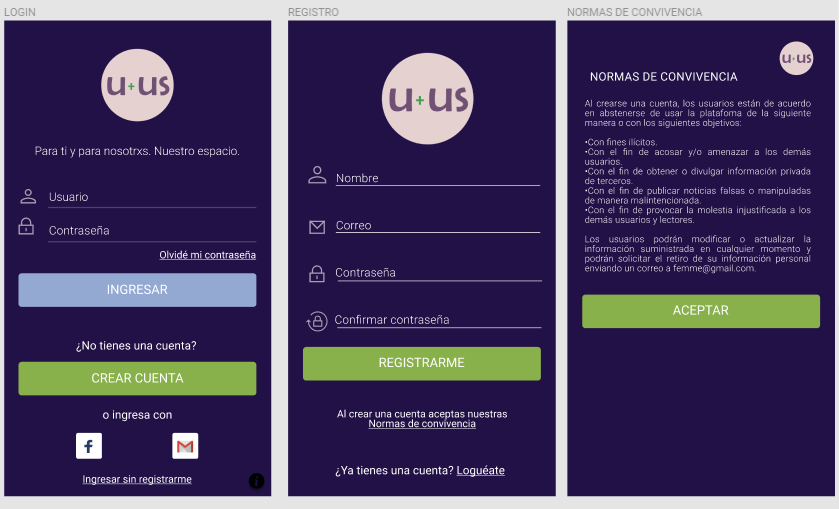
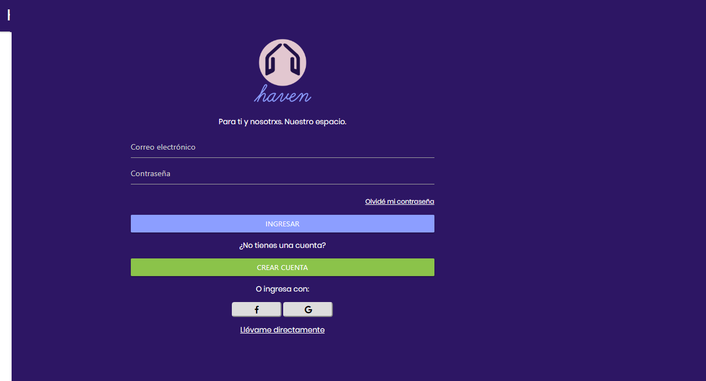
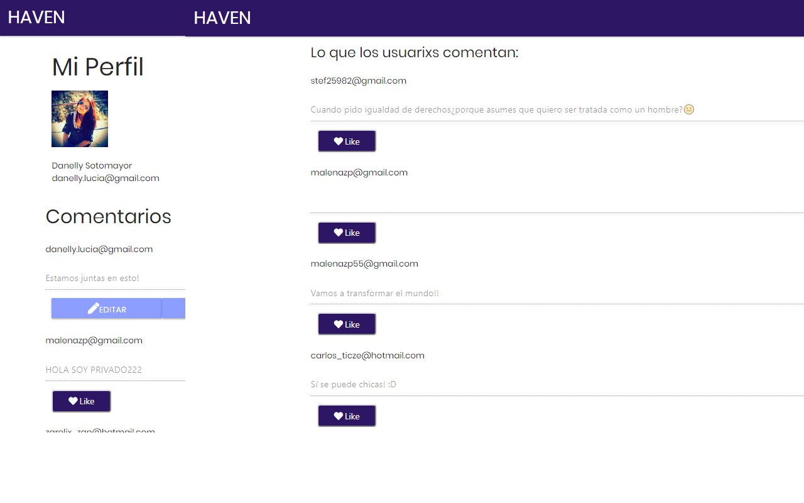
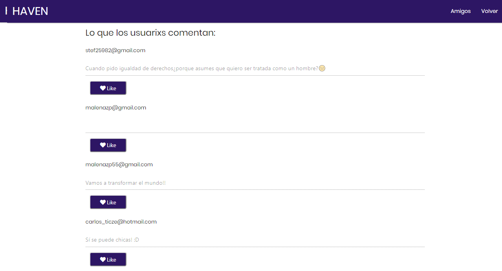
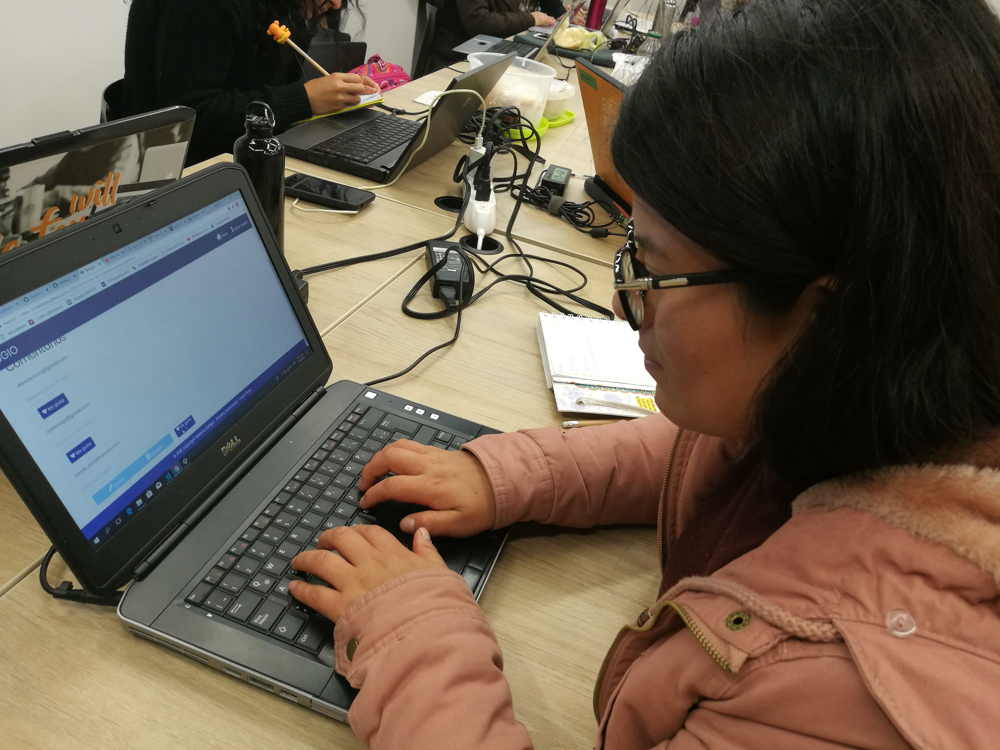

# Proyecto 3: Feminist Social Network
## Preámbulo
Instagram, Snapchat, Twitter, Facebook, Twitch, Linkedin, etc. Las redes sociales han invadido nuestras vidas. Las amamos u odiamos, y muchxs no podemos vivir sin ellas.
Hay redes sociales de todo tipo y para todo tipo de intereses. Por ejemplo, en una ronda de financiamiento con inversionistas, se presentó una red social para químicos en la que los usuarios podían publicar artículos sobre sus investigaciones, comentar en los artículos de sus colegas, y filtrar artículos de acuerdo a determinadas etiquetas o su popularidad, lo más reciente, o lo más comentado.
## Introducción
Se nos encargó la elaboración de una red social para una emprendedora que desea invertir en el ámbito de alimentación, feminismo, educación, salud o energías renovables. Como equipo, escogimos el feminismo como tema principal para plantear esta nueva red ya que nos encontramos en un contexto social que lo amerita, lo cual fue validado luego de aplicar los métodos y técnicas de User Experience Design que detallaremos líneas abajo.
## Proceso de planeamiento
Para realizar la planificación del proyecto, utilizamos el método Kanban para tener un avance de forma incremental detallado en el Backlog de Producto.
Asimismo, se utilizó la técnica Historias de Usuario, como se aprecia en la siguiente imagen.

## UX Design
En el ámbito de la Experiencia de Usuario (UX) se plantearon dos técnicas de research y recojo de la información:
### Benchmarking
Analizamos páginas web y redes sociales similares a la temática que vamos a implementar. En primer lugar, tenemos a las redes sociales más utilizadas en general: Facebook, Twitter e Instagram. Cada una de estas tres redes tiene una forma distinta de comportarse frente al usuario y sus objetivos.

**Facebook:** es la red social con más usuarios activos al mes. Permite compartir información a través de links, imágenes, videos y textos; y es capaz de viralizar contenido rápidamente, sin embargo, la vida activa de las publicaciones no viralizadas no tiene mucha duración. Se ha convertido en un aliado de las empresas para generar branding.

**Instagram:** es la segunda red social más activa. Inició como una aplicación para teléfonos móviles, y está orientado a compartir fotografías, por lo que es más emocional que otras redes sociales. Hace uso frecuente de hashtags (#) para agrupar contenido. Cuenta como pain la imposibilidad de colocar links en el copy de sus publicaciones.

**Twitter:** tercera red social con mayor número de usuarios activos al mes. Creador de los hashtags para agrupar contenido, restringe a 280 caracteres las publicaciones, lo que limita a cierto nivel el contenido de las publicaciones. Su tono comunicacional es más racional que las dos anteriores.

En segundo lugar, hemos analizado 4 páginas web - que también cuentan con perfiles de Facebook o Instagram - que cuentan con una temática similar a la que queremos plasmar en nuestra red social:

[**MAKERS**](https://www.makers.com/about)

Media Brand feminista que realiza contenido original que comparte en sus redes sociales. Se apoya en la producción de videos y contenido audiovisual.
En Facebook comparte enlaces a su propia página web e imágenes con contenido exclusivo para redes, lo cual se aprecia en las medidas. 
El contenido que publican consta de entrevistas a mujeres del medio (actrices, deportistas, políticos, chefs, aliados, etc.), fotografías positivas, enlaces a contenido de su web, entre otros relacionados. El engagement se refleja en las veces en que su contenido fue compartido, sin embargo, no impulsa la interacción en los comentarios.

[**GURLSTALK**](http://www.gurlstalk.com/)

Plataforma web y red social creada para que las mujeres puedan compartir experiencias y sentimientos sin ser juzgadas. 
Utiliza como redes principales el Facebook e Instagram para compartir información sobre body positivism a través de poesía, ensayos, fotografía y arte. Su página web no permite la interacción.

[**LADIES GET PAID**](http://www.ladiesgetpaid.com/partner-2/)

Social network donde mujeres comparten consejos, asesorías y eventos referentes a la colocación laboral. Brindan herramientas a las mujeres y empresas para que puedan incrementar ya sea el número de mujeres que laboran o el salario que se merecen.
Sí brinda una plataforma dedicada exclusivamente a la mujer, sin embargo, el contenido se comparte a través del formato de blog, lo cual no permite la interacción en su página web, tan solo en sus redes sociales.

[**WOMAN INTERRUPTD**](http://womaninterruptedapp.com/en/)

A pesar de no ser una red social, es una aplicación que involucra al feminismo y se considera como una propuesta tecnológica interesante.
Permite registrar las veces en que una mujer es interrumpida por un hombre cuando está hablando. Así, recolecta data y la transforma en estadísticas que reflejan esa problemática.

### Encuestas
Luego de la información recolectada en el benchmarking, se realizó la siguiente encuesta para corroborar lo obtenido:

Relación de preguntas:
1. ¿Te consideras feminista?
2.	¿Estarías interesadx en formar parte de una red social feminista?
3.	En escala del 1 (nunca) al 5 (siempre) indica qué tan activamente has participado en las actividades de la comunidad feminista de tu ciudad.
4.	¿Qué tipo de actividades te gustaría realizar dentro de la red social feminista? Puedes marcar más de una opción.
    * Conocer más personas feministas.
    * Organizar y participar en eventos.
    * Estar actualizad@ sobre las noticias que afectan a la comunidad feminista.
    * Subir y bajar información (fotos, videos y textos) vinculados al movimiento.
    * Otro:
5.	¿Qué tipo de actividad te gustaría asumir dentro de la red social feminista? Puedes marcar más de una opción.
    * Me gustaría recibir asesoría legal.
    * Me gustaría brindar asesoría legal.
    * Me gustaría recibir asesoría psicológica.
    * Me gustaría brindar asesoría psicológica.
    * Me gustaría recibir asesoría en otro tipo de ámbito.
    * Me gustaría brindar asesoría en otro tipo de ámbito.

**Resultados:**
Para el tema de interés, los resultados más resaltantes fueron los siguientes:

***¿Estarías interesadx en formar parte de una red social feminista?***
El 74,8% de los encuestados están interesados en formar parte de una red social feminista, lo que sugiere una alta demanda y aceptación de la propuesta. Por otro lado, el 19,1% no está seguro de formar parte y marcó “tal vez”, por lo que se considera que su respuesta afirmativa estaría condicionada por el contenido de la red social.

***¿Qué tipo de actividades te gustaría realizar dentro de la red social feminista?***
En otra pregunta, el 80,7% considera que esta red social le serviría para estar actualizadx sobre las noticias que afectan a la comunidad feminista. Mientras que un 60,5% la utilizaría para organizar y participar de eventos.

***¿Qué tipo de actividad te gustaría asumir dentro de la red social feminista?***
Con respecto a la pregunta sobre qué actividad o rol asumiría dentro de esta red social, un 42,5% le gustaría brindar asesoría en otro tipo de ámbito, diferente a la legal y psicológica. Asimismo, un 37,7% le gustaría recibir asesoría legal.

### Entrevista a usuarios:

Para confirmar los resultados del benchmarking y las encuestas, realizamos dos entrevistas a posibles usuarias de esta red.

**Highlights - Entrevista 01**

Entrevistada: Katherine Chimoy Vega (25 años), publicista y activista del movimiento Ni una menos.

* ¿Conoces alguna red social, como Facebook, Twitter o Instagram, dedicada exclusivamente al movimiento feminista? *No, hasta el momento no he visto ninguno sobre el tema.*

* ¿Qué te imaginas cuando se menciona “red social feminista”?
*Un espacio libre para denuncias, donde no tengas riesgo de ser atacado. Un espacio para liberarte, como en el grupo de Ni una menos, pero trasladado a una red social. Donde el acceso pueda ser regulado y no entre gente que te ataque o use tus palabras en tu contra.*

* ¿Para qué utilizarías esta red social?
*Para encontrar apoyo. Personalmente me desgasta mucho compartir mis ideas y verme cuestionada o atacada constantemente en las redes que suelo utilizar. Sería como un lugar donde me pueda sentir libre de expresarme y compartir lo que pienso, y donde además podría encontrar apoyo en lxs demás usuarixs.*
* ¿Crees que sería útil una red social como esta?
*Sí, porque no existe hasta el momento. Puede ser un espacio para personas que de verdad tienen el objetivo de aprender sobre el tema. Sería muy chévere encontrar un espacio donde haya gente que te puede asesorar. Por ejemplo, en la red de Ni una menos, solo podemos derivar a las personas que nos consultan a la línea 100, pero no hay alguien especial que pueda darle asesoría.*

* ¿Qué temas esperarías que se compartan en una red social como esta?
*Entretenimiento, imágenes, links de información. Cosas que en parte también sirvan de distracción para nosotras, pero que aún así nos mantengan informadas.*

* ¿Qué opciones esperarían encontrar en una red social como esta?
*Un muro donde compartir lo que una (usuarix) desee y aparte, un chat o canal donde podamos realizar consultas y otrxs usuarixs nos puedan asesorar sin juzgarnos.*

* ¿De qué colores se imaginan una red social como esta?
*Me lo imagino con colores representativos de los movimientos feministas: morado por Ni una menos, y verde por el movimiento a favor del aborto.*

**Highlights - Entrevista 02**

Entrevistada: Claudia Ulloa Villena (27 años), psicóloga y feminista.

* ¿Conoces alguna red social, como Facebook, Twitter o Instagram, dedicada exclusivamente al movimiento feminista? *No, solo he visto páginas de ese corte en Facebook pero no una red en sí.*

* ¿Qué te imaginas cuando se menciona “red social feminista”? *Un espacio para compartir información, y para poder prevenir. Es lo que hace falta: prevenir informando todo lo que se pueda.*

* ¿Para qué utilizarían esta red social? *Desde mi carrera, apoyaría en labor de prevención. Quizá segmentando una parte especial para brindar apoyo a las que lo necesiten.*

* ¿Creen que sería útil una red social como esta? *Sí, de todas maneras hace falta, especialmente en estos tiempos donde hay mucha violencia contra la mujer.*

* ¿Qué temas esperarían que se compartan en una red social como esta? *Información sobre las últimas noticias que vemos acerca del tema, enlaces a libros o eventos feministas, consejos, imágenes.*

* ¿Qué opciones esperarían encontrar en una red social como esta? *Dos opciones, una que involucre a las afectadas o aquellas que necesiten algún tipo de apoyo, un lugar donde puedan dejar sus consultas o dudas, y otra donde aquellas personas que queramos brindar apoyo podamos hacerlo de manera sencilla. Creo que serviría más que nada para conectar personas que queremos ayudar con aquellas que lo necesitan.*

* ¿De qué colores se imaginan una red social como esta? *Colores vivos, como el naranja o amarillo.*

### Conclusiones de investigación - necesidades del usuarix

**Problemas identificados**
- Carencia de una red social propiamente feminista.
- Carencia de moderación en los grupos o páginas en Facebook o Twitter.
- Sensación de inseguridad para expresarse en otras redes sociales. El usuarix se siente constantemente observado.

**Necesidades del usuarix**

Tras la investigación realizada, se identificó como necesidad principal la existencia de una red social propia para personas que apoyen el movimiento feminista, ya que no existe un espacio totalmente dedicado a este ámbito como red social. Si bien es cierto, existen grupos y páginas en otras redes sociales, los posibles usuarios manifestaron que aún no los identifican como un espacio seguro y/o propio para poder expresarse.

## Definición del producto

**Principales usuarios**

Nuestro público objetivo principal son mujeres peruanas que se identifican como feministas y que necesiten un espacio seguro donde poder expresar sus ideas sin sentirse observadas.
Como público objetivo secundario identificamos a aliados y personas que apoyan el movimiento feminista y deseen brindar apoyo y soporte en esta comunidad.

**Objetivos de los usuarios en relación al producto**

* Publicar y compartir ideas y noticias relacionadas al movimiento feminista con su comunidad.
* Encontrar un grupo de apoyo y soporte.
* Encontrar un espacio y plataforma segura donde expresarse.
* Poder identificar como "propio" un espacio en la red.

**Nombre**

Hemos optado por utilizar el nombre "Haven" ya que significa "refugio" o "lugar seguro", lo cual representa la necesidad del usuarix en referencia a los problemas encontrados en la investigación.

**Colores**
Luego de lo conversado con los usuarios, llegamos a la elección de que la paleta de colores debe estar asociada a los movimientos feministas que ya existen para poder ganar afluencia de manera rápido: morado y verde.

### Elementos básicos de una red social a incorporar en el proyecto

Luego de realizar la investigación previa, hemos planteado una red social feminista que incluirá los siguientes elementos:
* Registro de usuarios con correo electrónico
* Registro de usuarios con Facebook y Gmail
* Login de usuarios con correo, Facebook y Gmail
* Muro principal con posibilidad de compartir posts públicos
* Perfil donde podrá ver sus post privados

### Funcionalidad de Haven

**Registro de usuarixs**

- Registro con correo electrónico y contraseña: el usuario que quiera registrarse podrá realizarlo con un correo que será validado y una contraseña de más de 6 dígitos. Una vez registrado, se le enviará un correo de confirmación al email indicado.

- Registro con redes sociales: el usuarix podrá registrarse con sus cuentas de Gmail y Facebook. El nombre, foto y email de dichas cuentas, se imprimirá en su perfil privado.

**Login de usuarixs**

- Login con correo electrónico: una vez que el usuarix haya confirmado su correo electrónico, podrá loguearse con los datos ingresados. Se validará que el correo ingresado tenga el formato correcto y se encuentre en la base de datos. Asimismo, si desea recuperar la contraseña, podrá realizarlo haciendo clic en "Olvidé contraseña".

- Login con redes sociales: el ingreso con redes sociales a la web es directa al hacer clic en los botones de Facebook o Gmail.

**Perfil de usuarixs - privado**

- Sección de información de usuarix: aparecerá el nombre del usuarix si ingresó con Facebook o Gmail, o un nombre genérico si ingresó con correo electrónico. 

- Sección de publicar: se encontrará una opción donde el usuarix podrá escribir un post según su preferencia y publicarlo en su muro.

- Selector para escoger privacidad: se implementó un selector con la opción "Público" o "Privado" en donde el usuarix podrá seleccionar el tipo de publicación que quiere realizar. Si selecciona "Privado" el post irá a su muro personal, si selecciona "Público" el post irá al muro público general.

- Opción de editar y eliminar: el usuarix podrá editar el post que publicó y también podrá eliminarlo. Esta última opción será confirmada con un alert.

- Botón de likes: se implementó un botón contador de likes en cada publicación. Funcionará con usuarixs registrados y no registrados.

**Muro público**

- Publicaciones públicas: el usuarix registrado podrá ingresar al muro general y editar o eliminar el mensaje que publicó previamente. Sin embargo, si se trata de un visitante no registrado, solo podrá visualizar las publicaciones y darle likes.

- Botón "Conócenos": si se trata de un visitante, se le habilitará el botón "Conócenos" donde se desplegará un modal con la descripción de la red social.

- Botón "Volver": si se trata de un usuarix registrado, se habilitará el botón "Volver" que le permitirá al usuarix regresar a su perfil privado.

### Prototipo de alta fidelidad - N°1

A continuación presentamos el primer modelo de alta fidelidad elaborado en Figma para móbiles y PC, diseñado siguiente el principio Mobile First.
##### 1)Prototipo mobil:

##### 2)Prototipo pc: 

### Prototipo de alta fidelidad - N°2

### Conclusiones

**Testing con prototipo N°1:**

El usuario manifestó lo siguiente:
- Los colores eran demasiado pasteles, requería colores que contrasten más entre ellos.
- No identificaron jerarquía de colores en los botones de registro e ingreso.
- Faltaba la opción de recuperar contraseña.
- El logo no identificaba el movimiento feminista.

Asimismo, el usuario indicó que, por ser una red social donde se iban a tratar temas delicados, se necesitaba realizar la identificación de cada usuario e incorporar Normas de uso o convivencia para que se pueda moderar el uso de la red social. 

**Conclusiones:**
- Se decidió optar por colores más oscuros, que contrasten con los colores de letras.
- Cambiamos los colores de los botones para identificar jerarquías.
- Se incorporó la opción de recuperar contraseña de Firebase.
- Se ralizó el cambio de logo y nueva propuesta de nombre.

**Testing con prototipo N°2:**

El usuario manifestó lo siguiente:
- Pudo identificar mejor los colores de cada botón y su jerarquía.
- Le agradó la idea de tener Normas de Convivencia pero se recomendó que sean más cortos y que se envíen también por correo electrónico.
- Sugirió tener una sección donde se describa mejor el objetivo de la página.

**Conclusiones**

Tras el último testing, se verificó que el usuarix encontraba más accesible la red social y más fácil de identificar cada botón. Asimismo, se pudo comprobar que tener una sección de "Normas de convivencia" al registrarse creaba en el usuarix la sensación de seguridad y confianza.

Asimismo, el usuarix se sintió identificado con los colores de la página, pues representaba el movimiento feminista.

**Testing con prototipo en HTML**

SECCIÓN DE LOGIN

SECCIÓN DE PERFIL PRIVADO

SECCIÓN DE MURO PÚBLICO

TESTING CON USUARIX

El usuarix manifestó lo siguiente:
- Pudo registrarse y loguearse con un correo electrónico fácilmente.
- Pudo registrarse y loguearse con Facebook y Gmail fácilmente.
- Pudo recuperar contraseña y crear una nueva.
- Se validó la colocación de un correo electrónico válido y un password de más de 6 caracteres al intentar registrarse.
- Pudo publicar un post en su perfil privado y en el muro público.
- Realizó con éxito la edición y eliminación de la publicación que realizó previamente.
- Pudo dar like a su publicación y a publicaciones de otros usuarixs en el muro público.

**Conclusiones**

Se comprobó que las funcionalidades propuestas corrían de la manera correcta y los datos del usuarix se almacenaban en nuestra base de datos de Firebase.

Por otro lado, según la manifestación del usuarix se deben implementar funciones adicionales para hacer la experiencia de usuarix más efectiva. Se propuso lo siguiente:

**Propuestas finales**

Para que el usuarix haga un uso constante de la red social, se propone lo siguiente:

- Promoción de la red social en grupos o comunidades feministas existentes como una red capaz de generar un espacio seguro donde compartir ideales y servir de apoyo a miembros del movimiento.
- Testing constante de la plataforma para incorporar mejoras y controlar la privacidad.
- Mejorar usabilidad de la interfaz principal incluyendo la descripción de la página desde un inicio.
- Mejorar accesibilidad del perfil privado para una mejor visión en dispositivos mobile.
- Incorporar la opción de comentarios y una sección de chat para incentivar más la conexión entre usuarixs.

## Equipo de trabajo
* [Maria Elena Zúñiga](https://github.com/malenazp)
* [Leyla Ticze](https://github.com/ticze)
* [Danelly Sotomayor](https://github.com/DanellySotomayor)
